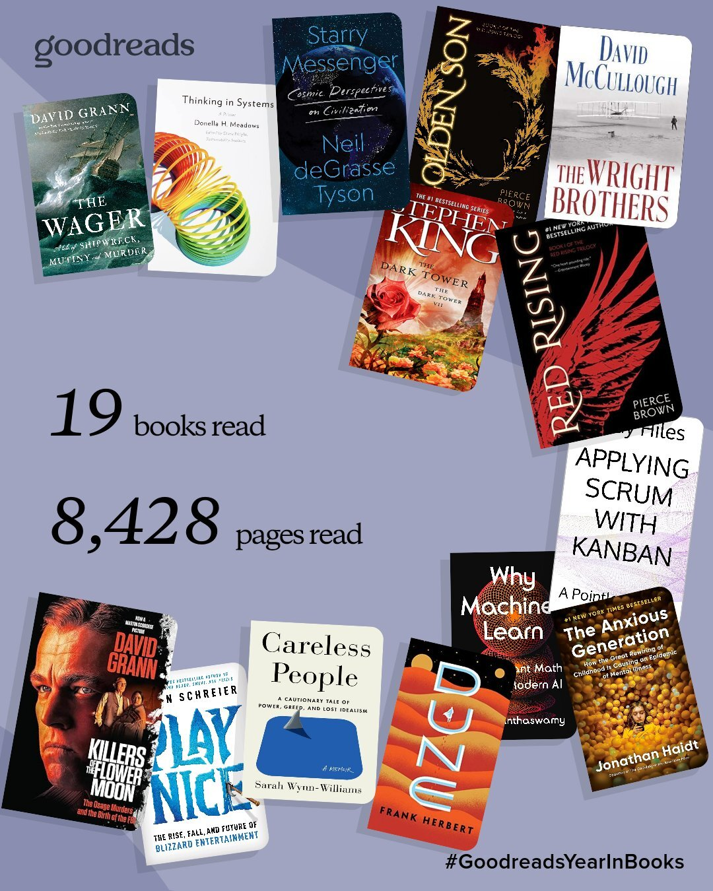

  
In an age of constant notifications, algorithmic feeds, and shallow scrolling, reading and sustaining deep focus feels increasingly rare. That is exactly why it matters.

In 2025, I read more books than I ever have. Not because I optimized for volume, but because I made space for focus. Reading became less about productivity and more about reflection. At the end of the year, I like to pause and ask a few simple questions: _What changed how I think? What challenged me? What helped me escape into another world for a while?_

As the Goodreads recap below shows, my reading tastes are all over the map. That is intentional. I use reading as a way to explore unfamiliar domains, revisit fundamentals, and occasionally get lost in a great story. I will not cover every book I read, but I do want to highlight a few that meaningfully shaped how I think, learn, and reflect.

## Seeing the world through systems
[Thinking in Systems: A Primer by Donella H. Meadows](https://www.amazon.com/Thinking-Systems-Donella-H-Meadows/dp/1603580557)

This one had been on my backlog forever, and I’m glad I finally brought it forward on the bookshelf. It’s a great introduction to seeing everything — and I mean everything — as part of a system: interconnected, dynamic, and often counterintuitive.

Meadows shows how systems have feedback loops and functions that are easy to misread, and she walks through vivid examples from society and history where leaders misunderstood a system’s structure and inadvertently made things worse.

**My biggest takeaway:** things are genuinely complex. You have to slow down and see the whole picture before rushing to address one part of it. Yet if you’re good at breaking complexity into digestible components — inputs, outputs, and feedback — you can reason your way through almost anything.

## Parenting in the attention economy
[The Anxious Generation](https://www.amazon.com/Anxious-Generation-Rewiring-Childhood-Epidemic/dp/0593655036)

I read _The Anxious Generation_ quickly. Mostly during a flight to and from a work trip. As a dad of three kids, this book hit close to home. Jonathan Haidt argues that many of the negative trends in youth mental health stem from the rise of smartphones, social media, and what he calls the “great rewiring of childhood.” The book blends data and narrative to examine how constant connectivity, fragmented attention, and less play-based development have contributed to rising depression and anxiety among younger generations.

**My biggest takeaway:** we need to think seriously about how we introduce technology in kids’ lives, not to vilify it, but to understand its deep psychological effects and protect mental well-being.

## Understanding how machines actually learn
[Why Machines Learn](https://www.amazon.com/Why-Machines-Learn-Elegant-Behind-ebook/dp/B0CF1223R8/)

This was easily the most demanding book I read all year.

_Why Machines Learn_ dives deep into the mathematical foundations of modern AI. It traces the history of the ideas that led to today’s models, from early geometry and linear algebra to the breakthroughs that underpin modern neural networks and large language models.

I have no plans to become a mathematician or work directly on model training anytime soon. This book is not light reading. That said, I found it incredibly valuable as a foundation. It demystified a lot of the “magic” surrounding AI by showing that underneath the abstractions are well-understood mathematical principles built up over decades.

One unexpected insight was how useful AI itself was as a study partner. Being able to pause, ask clarifying questions, and work through concepts interactively made the material far more approachable. There is not enough discussion about AI as a learning amplifier. That may be a future post.

In an era where AI is everywhere, this book helped ground my understanding of how we got here.

## History, hardship, and human nature
[The Wager](https://www.amazon.com/Wager-Tale-Shipwreck-Mutiny-Murder-ebook/dp/B0B6Z4SVTH/)

Looking back, this was probably my favorite book of the year.

_The Wager_ tells the story of HMS Wager, a British naval ship sent on a secret mission in the 18th century. The journey required rounding Cape Horn, one of the most dangerous passages in the world. Predictably, things went wrong. The ship wrecked, and the surviving crew found themselves stranded, forced to endure brutal conditions and impossible decisions.

What makes this book compelling is not just the historical detail, but the human element. Grann captures what life was like for sailors of the time, the social hierarchies onboard, and how authority and morality fracture under extreme stress.

It was a powerful reminder of the hardship people once willingly endured just to explore and move across the world. It brought to mind John F. Kennedy’s famous line: _we do these things not because they are easy, but because they are hard._

I enjoyed this book enough that I immediately picked up another by the same author, _Killers of the Flower Moon_. While I did not enjoy it quite as much as _The Wager_, I do not regret reading it. If you enjoy history that feels alive and unsettling, Grann is worth your time.

## Making space for fiction
I am a strong believer that we should read more fiction, not less. There is growing evidence that men, in particular, are reading less fiction than ever. That is unfortunate. Fiction builds empathy, stretches imagination, and offers a different kind of cognitive workout than non-fiction. There is also a great TED talk that explores these benefits in more depth. https://youtu.be/6QWTp5rIWYU?si=TBPKK_cdLFxQd_AG

My favorite fiction reads of the year were:

[Dune](https://www.amazon.com/Dune-Frank-Herbert-audiobook/dp/B000R34YKC/)
I finally started _Dune_ this year and made it through the first three books. They can be dense at times, but I thoroughly enjoyed them. The world-building, political tension, and long-arc storytelling lived up to the hype. I will return to the series eventually.

[Red Rising](https://www.amazon.com/Red-Rising-Book-ebook/dp/B00CVS2J80/)
This was a standout. I do not even remember what initially pushed me to pick up the first book, but I am glad I did. I finished the first two books before the end of the year and started _Morning Star_ shortly after. Each installment has been better than the last.

If you are looking for a gripping story to pull you back into fiction, I cannot recommend this series enough.

  

## What's on the 2026 List
As you can probably tell, my reading backlog has no coherent theme. That is intentional. I recently started _Effective Platform Engineering_ and finished _Deep Work_ by Cal Newport. I expect 2026 to look similar: a mix of history, technical depth, and fiction.

If you have a great recommendation, whether it is platform engineering, history, or the next series to pick up after _Red Rising_, I would love to hear it. My backlog is always growing, and that feels like a good problem to have.